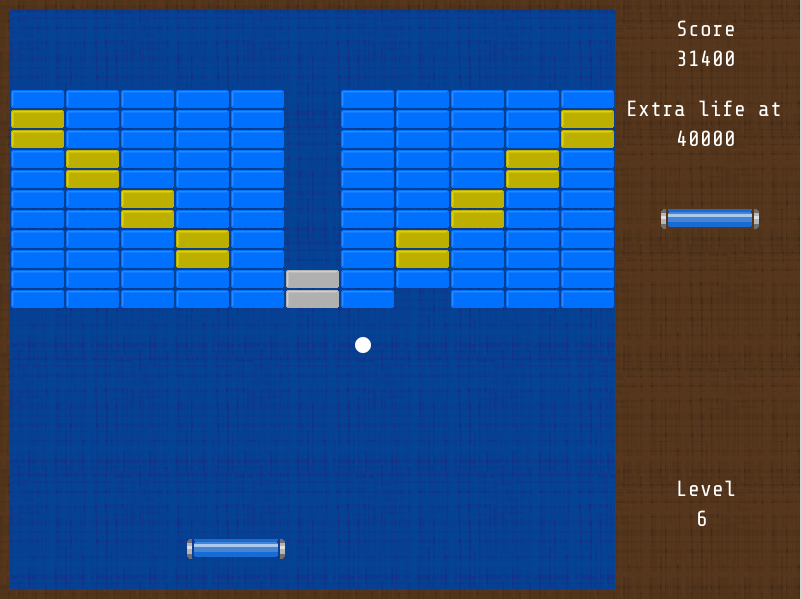
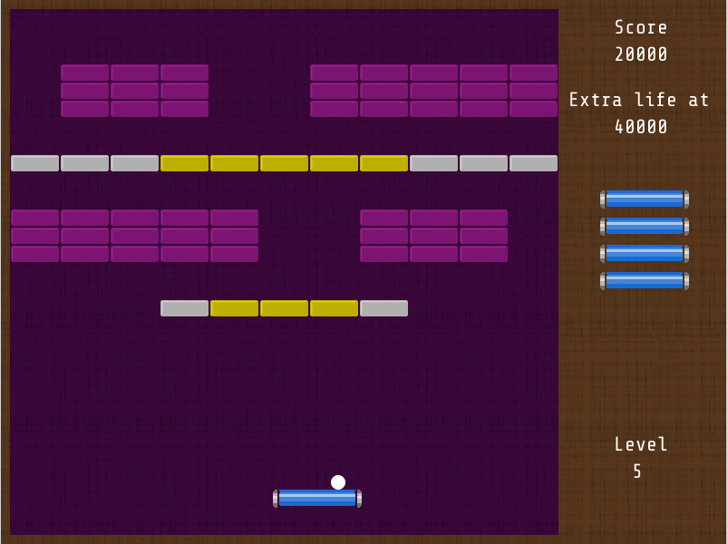

##Jashanoid

A game developed in java using [libgdx](https://github.com/libgdx/libgdx) framework.




###Fully playable

The game is in a finished state, with the posibility of adding new levels or do minor tweaking. Collisions and bounces are working as expected, although that parts were a headache, sorry for the bad coding there. 


###Level Creation

The level creation is handled by reading textfiles, with the positions of the bricks.

For example, level_5.txt contains:

```
 444  44444
 444  44444
 444  44444


***+++++***  
 

44444  444
44444  444
44444  444


   *+++*
```

and produces: 



####Level creation instructions

You can create a new level by creating a new .txt called "level_N.txt". (N = number of level). Use the following characters:

'1' = normal blue brick
'2' = normal red brick
'3' = normal green brick
'4' = normal purple brick
'5' = normal orange brick		
'*' = hard brick
'+' = indestructible brick

A new line in file, means a new line of bricks.
The width limit is: 11 bricks. If you use more than 11, it won't work as intended.


I hope you enjoy it, have fun!


