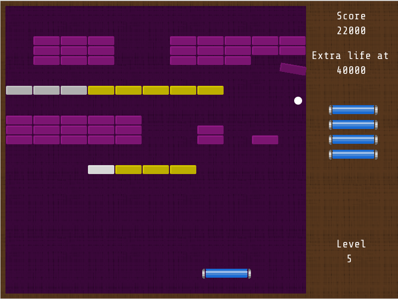

##Jashanoid
=============

A game developed in java using [libgdx](https://github.com/libgdx/libgdx) framework.


###Level Creation

The level creation is handled by reading textfiles, with the positions of the bricks.

For example, level_5.txt contains:

```
 444  44444
 444  44444
 444  44444


***+++++***  
 

44444  444
44444  444
44444  444


   *+++*
```

and produces: 




###Fully playable

The game is in a finished state, with the posibility of adding new levels or do minor tweaking. Collisions and bounces are working as expected, although that parts were a headache, sorry for the bad coding there. 

I hope you enjoy it, have fun!


